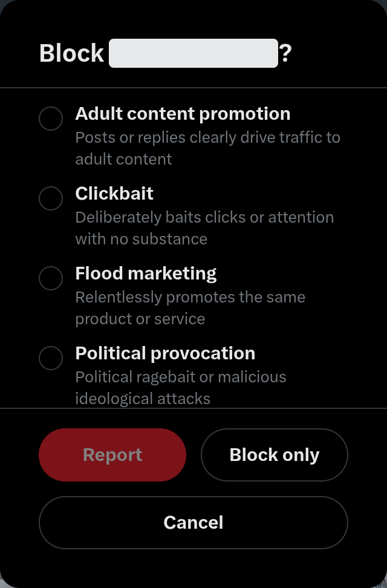
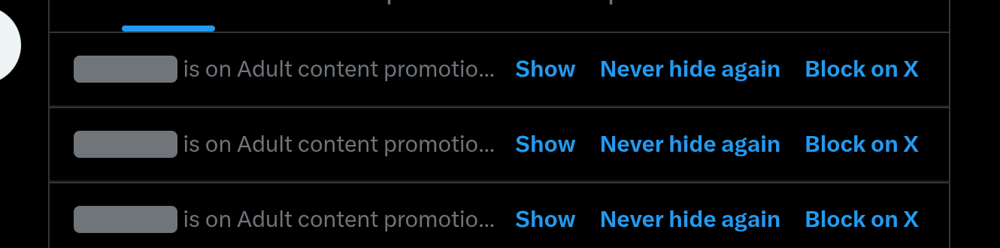

# Xlear

**A shared blocklist for X (Twitter).** Subscribe to the filter lists you care about, and posts from
listed accounts are hidden while you browse.

_[中文](README.zh.md)_

## Why

Open X for two minutes and you meet the same thing: reply bots, engagement bait, scam links,
and the odd account that shows up under every post. Blocking them one by one is endless work —
and thousands of people are doing the exact same blocking, by hand, every day.

Xlear turns that into a shared list. One person reports a spam account, an AI checks the evidence
before it goes in, and from then on everyone subscribed to that list stops seeing it.

## What it does

- **Hides the noise.** Posts from listed accounts are hidden right in the timeline, with a small card
  in their place. One click brings a post back; another keeps that account off your feed for good.
- **Turns blocking into a report.** When you click Block on X, X's confirmation dialog is replaced by a
  short reason picker built from the lists you subscribe to. Pick one and confirm — X sends the block,
  and the report goes to the platform for review.
- **Stays out of the way.** It works with X's own interface: nothing new to learn, no separate app,
  no fake buttons.
- **Only hides.** Xlear never blocks, mutes or posts on its own. The block request is always sent by X,
  after you confirm it.
- **Speaks your language.** English, 中文, 日本語, Русский.

## The filter lists

| List | What it catches |
| --- | --- |
| Flood marketing | Relentlessly promotes the same product or service |
| Empty reply bot | Meaningless summaries or add-ons when replying, with AI-text traits |
| Low-effort hostility | Offensive, mocking or heated disagreement that misses the point |
| Fraud & sexual solicitation | Posts or replies involve clear fraud or solicitation of sexual services |
| Adult content promotion | Posts or replies clearly drive traffic to adult content |
| Clickbait | Deliberately baits clicks or attention with no substance |
| Political provocation | Political ragebait or malicious ideological attacks |
| Polarisation & extremism | Deliberately stirs division, baseless extremes or irrational defences |

You choose which lists to apply — nothing is on by default. Accounts land in a list only after review,
and every listed account can be appealed on the website.

## Screenshots

<table>
  <tr>
    <td valign="top"></td>
    <td valign="top"></td>
  </tr>
</table>

## Install (release builds)

Grab a build from [Releases](https://github.com/LaneSun/xlear-extension/releases):

- `xlear-extension-X.Y.Z.xpi` — Firefox. **Unsigned**: release Firefox only installs AMO-signed
  extensions; use Developer Edition / Nightly with `xpinstall.signatures.required = false`,
  or sign it on AMO yourself.
- `xlear-extension-X.Y.Z.crx` — Chromium browsers. Off-store CRX installs are blocked by default;
  use an enterprise policy (`ExtensionInstallForcelist`) or drag it onto `chrome://extensions`.
- `xlear-extension-X.Y.Z-chrome.zip` — unzip, then "Load unpacked" in `chrome://extensions`.

Every release ships `SHA256SUMS` alongside the artifacts; the pipeline is documented in `docs/RELEASING.md`.

## Development

Build conventions, module map and gotchas: [AGENTS.md](AGENTS.md).

License: UNLICENSE (public domain).
